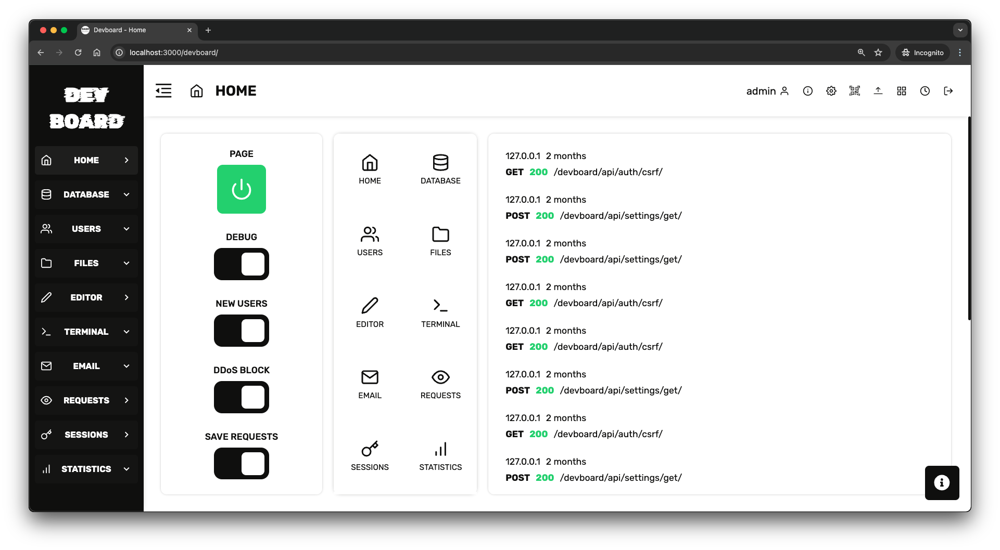
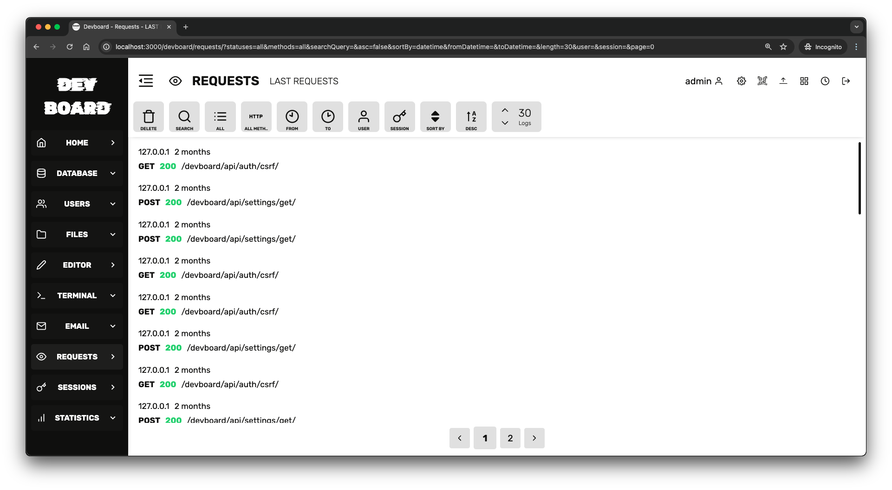
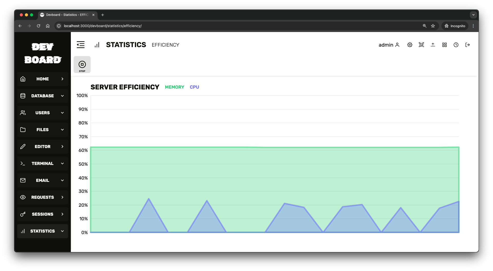
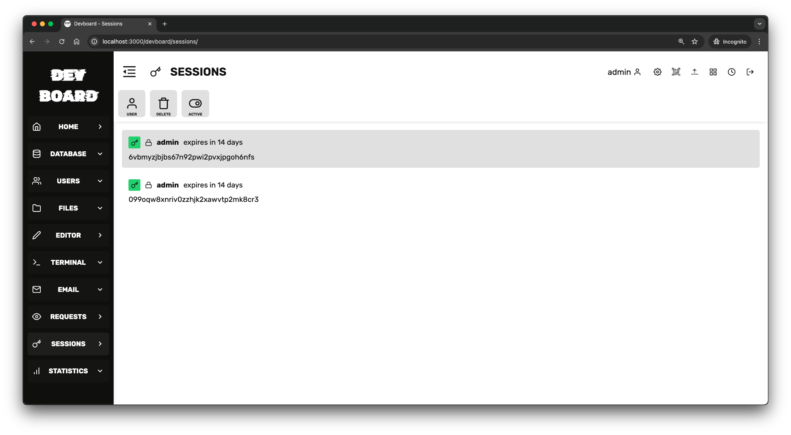
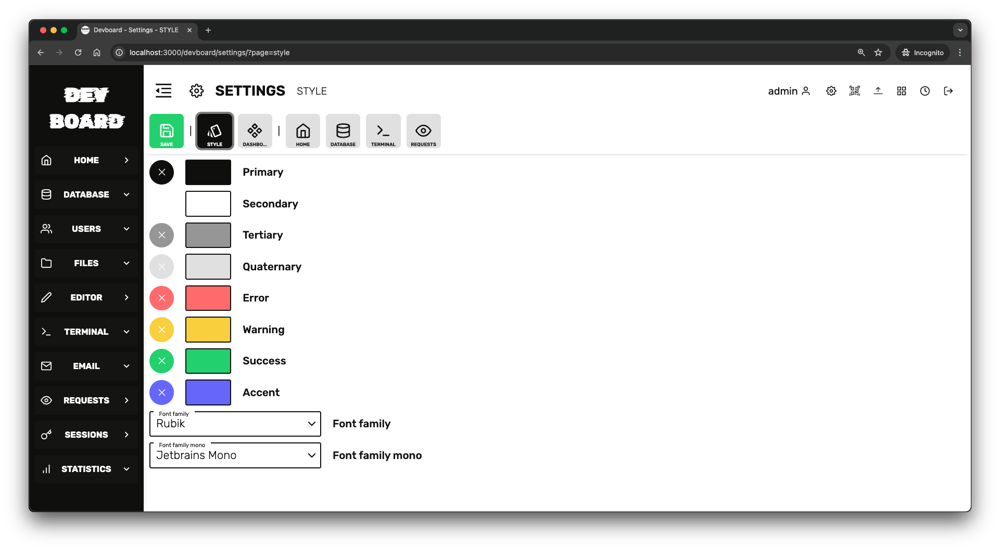
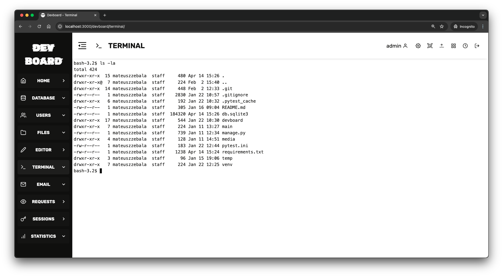
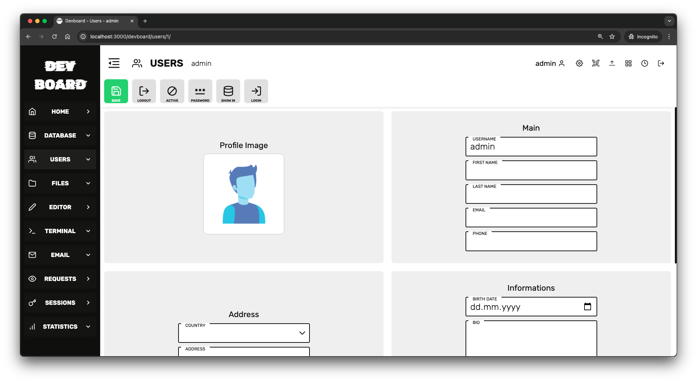

# Devboard 

## devboard is a panel for django server administration. 

### It contains functionals such as: 

1. Database managment
2. Users managment
3. Files managment
4. Code and image editor
5. Terminal
6. Requests managment
7. Session managment
8. Statistics

### Here are some screenshots:










## How to run it?


### API
```bash
pip install -r requirements.txt

python manage.py runserver 0.0.0.0:8000
```

### APP
```bash
cd devboard/app
npm install
npm start
```

### Problems with urls

If you want to run a server on other host than localhost or other port then 3000 and 8000. You should edit config files.

`devboard/configuration/settings.json` - Here is a config file.

also you have to edit `devboard/app/public/manifest.json`

